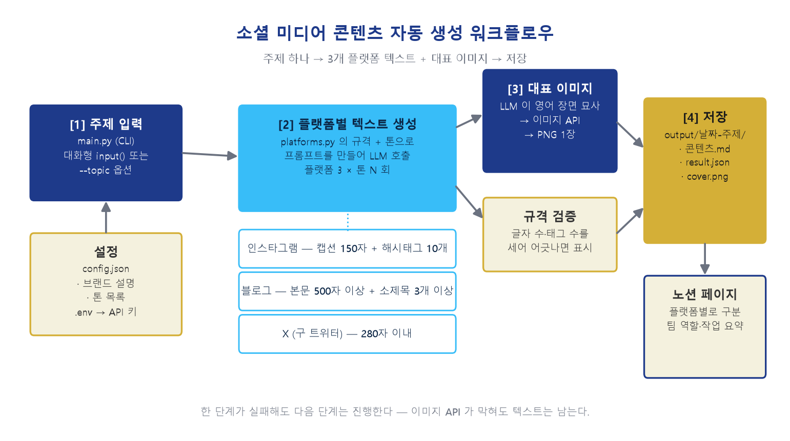

# 소셜 미디어 콘텐츠 자동 생성

주제 하나를 넣으면 **인스타그램·블로그·X 용 텍스트와 대표 이미지**를 한 번에 만들어
플랫폼별로 정리해 저장하는 워크플로우입니다.

> 코디세이 대전 캠퍼스 AI 네이티브 과정 · **B2-3 [Project C] AI 기반 소셜 미디어 콘텐츠 자동 생성**

실제로 운영 중인 서비스
[**VisitHolyKorea**](https://github.com/linkcontent7-huisun/visitholykorea)(한국 가톨릭 성지 208곳 순례 안내)의
**홍보 콘텐츠**를 만드는 데 씁니다.

---

## 빠른 시작

```bash
pip install -r requirements.txt
cp config.example.json config.json
cp .env.example .env      # .env 를 열어 GEMINI_API_KEY 를 채웁니다
python main.py
```

```
📣 소셜 미디어 콘텐츠 자동 생성

주제 또는 키워드를 입력하세요: 가을에 걷기 좋은 성지순례길
```

| 옵션 | 뜻 |
| --- | --- |
| `--topic "..."` | 주제 (주면 묻지 않습니다) |
| `--ab` | **[보너스]** 친근·전문 두 톤을 모두 만들어 A/B 비교 |
| `--tone friendly\|professional` | 톤 하나만 |
| `--no-image` | 대표 이미지 없이 텍스트만 |
| `--brand "..."` | 브랜드 설명을 그때만 바꿔서 |

---

## 워크플로우



| 단계 | 하는 일 |
| --- | --- |
| **[1] 주제 입력** | 대화형 `input()` 또는 `--topic` 이 워크플로우를 트리거 |
| **[2] 텍스트 생성** | 플랫폼 × 톤 조합마다 LLM 호출 → 규격을 세어 검증 |
| **[3] 대표 이미지** | LLM 이 영어 장면을 쓰고 → 이미지 API 가 그린다 |
| **[4] 저장** | `output/날짜-주제/` 에 플랫폼별로 구분해 저장 |

단계별 역할과 연결 구조는 [`docs/워크플로우.md`](docs/워크플로우.md) 에 있습니다.

**한 단계가 실패해도 다음 단계는 진행합니다.** 이미지 API 가 막혀도 텍스트는 남습니다.

---

## 플랫폼별 규격

`platforms.py` 한 파일이 "플랫폼마다 무엇이 다른가"를 전부 담습니다.
플랫폼을 더하거나 규격이 바뀌면 여기만 고치면 됩니다.

| 플랫폼 | 규격 | 받는 형식 |
| --- | --- | --- |
| 인스타그램 | 캡션 150자 내외 + 해시태그 10개 | `{caption, hashtags[]}` |
| 블로그 | 본문 500자 이상 + 소제목 3개 이상 | `{title, sections[{heading, body}]}` |
| X (구 트위터) | 280자 이내 (프롬프트에는 **240자**로 여유) | `{text}` |

**받는 형식을 쪼갠 이유:** 캡션과 해시태그를 한 덩어리 문자열로 받으면 글자 수를 셀 수 없습니다.
따로 받아야 규격을 검증할 수 있습니다.

### 부탁하고 끝내지 않고, 센다

프롬프트에 "280자 이내" 라고 적어도 모델은 넘깁니다.
그래서 생성 뒤에 실제로 세어 보고, 어긋나면 결과에 표시합니다.

```
⚠️ 규격 확인 필요: 280자 초과 (312자)
```

버리지는 않습니다. 사람이 보고 판단할 문제이기 때문입니다.

---

## 결과물

실제로 돌린 결과는 [`samples/`](samples/) 에 있습니다.
→ **[생성된 콘텐츠 보기](samples/콘텐츠.md)**

<table>
<tr><td width="42%">


</td><td>

**주제:** 가을에 걷기 좋은 성지순례길

**인스타그램 (친근한 톤)**

> 선선한 바람이 부는 가을, 복잡한 마음을 비우고 조용히 걷기 좋은 길을 찾고 계신가요.
> 깊어가는 계절의 풍경을 마주하며 온전히 나에게 집중하는 산책 같은 순례를 떠나보세요.
> 누구나 편안하게 발걸음을 옮길 수 있는 고요한 쉼터가 되어드릴게요.

`#가을여행 #걷기좋은길 #국내여행 #산책 #힐링여행 #성지순례 #VisitHolyKorea #가을풍경 #여행에미치다 #마음쉼터`

*캡션 134자 · 해시태그 10개*

</td></tr>
</table>

한 번 실행에 **텍스트 6건(3 플랫폼 × 2 톤) + 이미지 1장**, 실패 0건.

---

## 프롬프트 설계

[`docs/프롬프트-템플릿.md`](docs/프롬프트-템플릿.md) — 초안 → 수정 → 최종 기록

초안은 그냥 *"블로그 글을 써줘"* 였습니다. 실제로 돌려 보니 이렇게 나왔습니다.

| 항목 | v1 초안 | v3 최종 |
| --- | --- | --- |
| 인스타 해시태그 | **5개** | 10개 |
| 블로그 본문 | **435자 · 소제목 0개** | 709자 · 소제목 4개 |
| 종교 권유 표현 | **"은혜가 가득한"** | 없음 |

마지막 항목이 특히 문제였습니다. VisitHolyKorea 는 *"신앙을 앞세우지 않는다"* 가 원칙인데,
프롬프트에 브랜드를 안 넣었으니 모델이 알 도리가 없었습니다.

**설계 원리 4가지**

1. **숫자로 적는다** — "짧게" 는 모델마다 다르게 읽고, "150자 내외" 는 같게 읽는다
2. **상한에 여유를 둔다** — 280자 제한이면 240자라고 적는다. 모델은 넘기는 쪽으로 틀린다
3. **출력 형식을 쪼갠다** — 한 덩어리로 받으면 셀 수 없다
4. **브랜드를 넣지 않으면 브랜드 톤이 나오지 않는다**

---

## A/B 테스트 (보너스)

[`docs/AB테스트.md`](docs/AB테스트.md) — 같은 주제로 톤만 바꿔 비교

톤 지시 한 줄이 **어미 수준까지** 먹혔습니다.

| 톤 | `~요.` | `~니다.` |
| --- | ---: | ---: |
| A안 (친근) | **17** | 3 |
| B안 (전문) | 2 | **13** |

지시하지 않은 곳까지 갈렸습니다.

- **A안**은 서비스가 화자로 나섭니다 — "쉼터가 되어드릴게요"
- **B안**은 사실을 끌어옵니다 — "가톨릭 성지 **208곳** 중"
- 해시태그도 갈렸습니다 — A안 `#여행에미치다`(커뮤니티) vs B안 `#트레킹`(검색형)

**결론:** 인스타·X 는 친근한 톤, 블로그는 전문적인 톤.
비신자를 향한 채널은 문턱을 낮추고, 검색 유입 채널은 정확성을 앞세웁니다.

---

## 노션에 올리기

`콘텐츠.md` 는 노션이 그대로 알아듣는 마크다운입니다.
**노션 페이지에 붙여 넣으면 소제목·인용·해시태그 블록이 살아납니다.**

완전 자동 업로드는 노션 통합 토큰이 필요해 붙이는 자리만 비워 두었습니다
([`docs/워크플로우.md`](docs/워크플로우.md) 참고). 토큰 없이도 워크플로우 전체가 돌아야 하기 때문입니다.

**실제 제출 페이지:** <https://app.notion.com/p/3c2be80e553b81fe9a5afc008bd0d7e4>
프로젝트 개요 · 팀 구성원 역할 · 개인별 작업 요약 · 플랫폼별 결과물이 담겨 있습니다.

---

## 노코드 툴로 옮기려면

이 파이프라인은 n8n 노드 4개와 1:1로 대응합니다.

| 이 프로젝트 | n8n |
| --- | --- |
| 주제 입력 | Form Trigger |
| 플랫폼별 텍스트 | HTTP Request ×3 |
| 규격 검증 | Code |
| 이미지 생성 | HTTP Request ×2 |
| 저장 | Notion |

옮길 때 그대로 복사할 수 있도록 프롬프트 전문을 문서에 남겨 두었습니다.

---

## 구조

```
main.py                     CLI — [1] 주제 입력과 트리거
social_content/
  config.py                 브랜드·톤 설정 + 환경 변수 (API 키는 .env 에만)
  ai.py                     LLM API 클라이언트
  platforms.py              플랫폼별 규격과 프롬프트 ← 플랫폼 추가는 여기만
  pipeline.py               [2] 텍스트 → [3] 이미지 → [4] 저장
docs/
  워크플로우.md             단계별 역할과 연결 구조
  프롬프트-템플릿.md        초안 → 수정 → 최종
  AB테스트.md               보너스 과제
  make_diagram.py           구조도를 그리는 코드
samples/                    실제로 돌린 결과물
```

### 개발 환경

Python 3.10 이상. 실제 검증은 **Python 3.14.2 / Windows 11**.

API 키는 코드에도 `config.json` 에도 적지 않습니다.
`.env`(또는 환경 변수)에만 두고, 설정에는 *어느 환경 변수를 볼지*만 적습니다.

---

## 문서

| 문서 | 내용 |
| --- | --- |
| [`docs/워크플로우.md`](docs/워크플로우.md) | 단계별 역할과 연결 구조 |
| [`docs/프롬프트-템플릿.md`](docs/프롬프트-템플릿.md) | 초안 → 수정 → 최종 |
| [`docs/AB테스트.md`](docs/AB테스트.md) | 보너스 — 톤 A/B 비교 |
| [`docs/requirements-checklist.md`](docs/requirements-checklist.md) | 명세 요구사항 대조표 |
| [`samples/콘텐츠.md`](samples/콘텐츠.md) | 생성된 콘텐츠 전문 |
